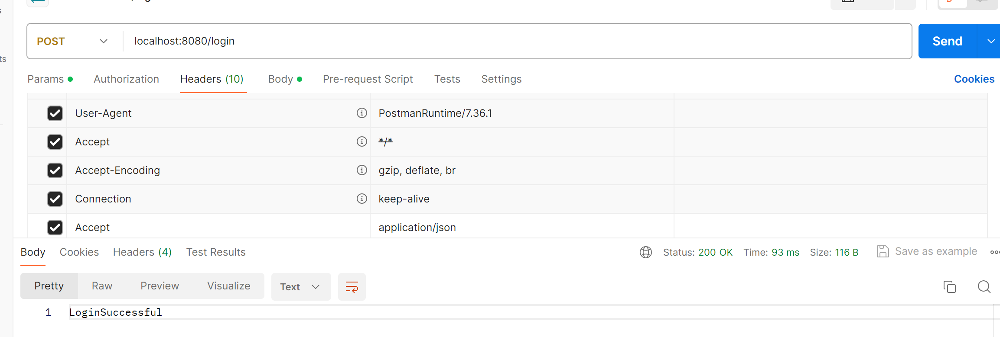
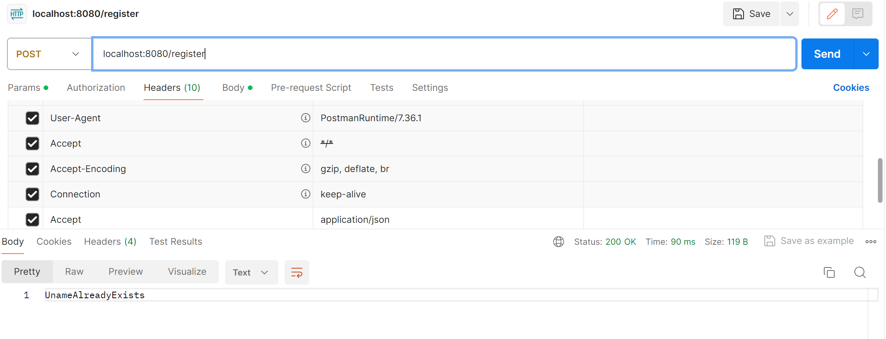

##                                     使用Java Socket API 搭建简单的HTTP客户端服务器程序


### 01 小组信息

#### 1. 小组序号：第四组
#### 2. 小组成员
|      姓名      |   学号    |
| :------------: | :-------: |
| 李一言（组长） | 221250023 |
|     许张涵     | 221250043 |
|     朱恩希     | 221250048 |
|     谷宁怡     | 221250077 |
|     王奕涵     | 221250082 |


### 02  程序介绍
#### 0.项目结构
documents——文档
resources——服务器资源
resources_client——客户端资源和缓存目录
src——源代码
其中项目源代码全部在src/main/java里面
pom.xml——maven项目构建脚本
#### 1.I/O模型
* 服务端采用nio模型，客户端采用bio模型。
#### 2.HTTP客户端
* **通过命令行提示输入服务器端口号与地址**，实现客户端与服务器的连接

首先询问是否开启长连接客户端，以此判断是否维持连接

然后询问是否加上If-Modified-Since来模拟304情况

```text
Persistent Client?(Y/N)
Y
填写If-Modified-Since:2024-06-23 12:34:45?
N
Quick Connecting?(Y/N)?
Y
```
最后询问连接的地址和端口，如果选择默认模式则连接localhost:8080
```text
Quick Connecting?(Y/N)?
N
Enter the host in the format <ip>:<port>
127.0.0.1:8081
```
最后询问启动Get还是Post
```text
请输入你的指令，GET请求请输入1，POST请求请输入2?
1
```
* **发起GET请求**：通过命令行发送请求报文、呈现响应报文

询问get的uri以后，将get报文通过stringBuilder转化为报文字段
```text
请输入你想访问的uri
/login
```
然后编码为二进制以后发送
* **发起POST请求**：

首先询问uri以及附带的数据段文件地址（在resources_client文件夹里面）
```text
请输入你想访问的uri
/login
请输入对应的文件路径
login.json
```
然后通过StringBuilder的方式来加上头部字段

最后再将文件字节流转化为字符形式附加再最后，得到完整数据报文
* **对200状态码处理**：

如果为get方法，截取数据报部分，将截取的数据报将与uri同名的名称储存再client_resources里面
```text
GET /index.html HTTP/1.1
Host: 127.0.0.1:8080
User-Agent: Client
Accept: */*
Accept-Language: zh-cn
Accept-Encoding: gzip, deflate
Connection: close

指令正在接收中...
HTTP/1.1 200 OK
Content-Type: application/html
Date:2024-01-24 22:31:01
Connection:close
Content-Length:879

file already saved to:C:\Users\李一言\Desktop\计算机网络\httpserver\untitled\resources_client\index.html
```
* **对304状态码处理**：

判断状态304

提醒客户端文件已经缓存，可以直接访问
```text
GET /index.html HTTP/1.1
Host: 127.0.0.1:8080
User-Agent: Client
Accept: */*
Accept-Language: zh-cn
Accept-Encoding: gzip, deflate
Connection: close

指令正在接收中...
HTTP/1.1 200 OK
Content-Type: application/html
Date:2024-01-24 22:31:01
Connection:close
Content-Length:879

file already saved to:C:\Users\李一言\Desktop\计算机网络\httpserver\untitled\resources_client\index.html
```
* **对302状态码处理**：
```text
GET /testrandomredirect.html HTTP/1.1
Host: 127.0.0.1:8080
User-Agent: Client
Accept: */*
Accept-Language: zh-cn
Accept-Encoding: gzip, deflate
If-Modified-Since: 2024-06-23 12:34:45
Connection: close

指令正在接收中...
HTTP/1.1 302 Found
Location: /redirectdest.html
Date:2024-01-24 22:37:07
Connection:close
Content-Length:0

Redirecting to:/redirectdest.html
指令正在发送中...
GET /redirectdest.html HTTP/1.1
Host: 127.0.0.1:8080
User-Agent: Client
Accept: */*
Accept-Language: zh-cn
Accept-Encoding: gzip, deflate
If-Modified-Since: 2024-06-23 12:34:45
Connection: close

指令正在接收中...
HTTP/1.1 304 Not Modified
Date:2024-01-24 22:37:07
Connection:close
Content-Length:0

Not Modified! you can view it on C:\Users\李一言\Desktop\计算机网络\httpserver\untitled/resources_client/redirectdest.html
```
客户端判断302立刻Get解析出来的报文Location字段的url


* **对301状态码处理**：同302
#### 3.HTTP服务端
* **响应GET请求**：

搜索资源列表，查找是否资源存在，如果不存在，则处理404状态码

如果找到资源，检查GET方法是否可用，如果不可用，则处理405状态码

如果资源GET方法可用，则检查是否产生重定向，以及重定向类型，如果发生则处理对应重定向

如果不发生重定向，比较If-Modified-Since和系统时间，

如果If-Modified-Since早于系统时间，则加载对应资源，附加到报文末尾并返回

否则则处理304 Not Modified
* **响应POST请求**：

搜索资源列表，查找是否资源存在，如果不存在，则处理404状态码

如果找到资源，检查POST方法是否可用，如果不可用，则处理405状态码

对于POST请求，根据POST的数据报字段，进行内部逻辑处理，返回对应url

（本次作业返回一个200 OK加上一个plain text）
* **对200状态码的处理**：

加载对应的资源，并以字节流的形式附加到数据报的末尾
* **对301状态码的处理**：

如果满足301的重定向条件，则返回301状态码，查找重定向表，并在头字段
添加Location:目标url
* **对302状态码的处理**：

查找资源重定向url表，其它与301相同
* **对304状态码的处理**：

比较If-Modified-Since和系统时间，如果前者迟于后者
则返回一个304 Not Modified状态码
* **对404状态码的处理**：

将响应行设置为 404 Not Found，并将404的页面以数据报的形式
附加到响应头数据报段
* **对405状态码的处理**：

将响应行设置为 405 Not Found，并将405的页面以数据报的形式
附加到响应头数据报段
* **对500状态码的处理**：

将响应行设置为 500 Not Found，并将405的页面以数据报的形式
附加到响应头数据报段
#### 4.长连接的实现：
（1）Connection字段的妙用
服务端解析客户端发送Connection: keep-alive字段，决定自己在处理完请求的时候
不断开连接，如果后面有一方发送的数据报Connection字段为close，则完成此次请求/传输以后断开连接

（2）长连接（websocket）心跳包实现
服务端接受客户端连接以后，开启客户端数据报接受的监听，如果监听到心跳包就做出应答
如果一段时间接受不到心跳包就断开连接

客户端在连接服务端之后，同时开启循环发送心跳包和监听服务端回复的线程，间隔一段时间发送一个心跳包，如果收到服务端的正常回复
就维持连接，否则也断开连接
#### 5.MIME支持的类型：
* image/png
* application/json
* text/plain
* text/html

#### 6.注册和登录的实现（补充具体的实现）

服务端在启动时从文件加载用户数据
服务端暴露/login和/register的接口，当请求POST这两个接口之一时
则服务端开始处理逻辑，服务端会将数据报中json格式解析为用户名和密码

如果是注册，在服务端进行用户名合法性校验和重复性检查以后，如果注册成功
则将用户信息添加到内存中储存用户信息的地方，并同步使用写直达的方式写入文件

如果是登录，则可以直接从内存中读取，并进行比较，

最终得到的结果将被附加到200OK数据报里面以PlainText的形式返回


### 03 关键代码解析（所有源代码都在src/main/java里面）
#### 类的分类
##### 客户端类
ClientMain:负责按照用户的请求发送报文、处理响应
##### 服务器类
ServerMain:服务器入口程序，进行数据初始化加载、属性配置

并循环监听、接受连接

ServiceThread:服务线程类，当接受连接以后，创建这个线程处理请求和连接控制

RequestHandler:读取请求，处理请求，返回请求
##### 心跳包类
HeartPacket:心跳包系统客户端

HeartRequestHandler:心跳包系统服务端
##### 数据报类
（父类）MessageHeader:数据报抽象类，描述response和request公共属性和方法

CToS->MessageHeader:request类数据报

SToC->MessageHeader:response类数据报
##### 工具类
datadumper:数据持久化写入文件

datareader:数据持久化读取装置

json:json装包解包

LoginResult:登录结果枚举

RegisterResult:注册结果枚举

Resource:资源信息以及资源表

user:用户信息和用户表
#### 插件使用（数据持久化和格式化装置）
com.alibaba.fastjson:json拆包解包

com.opencsv.opencsv:csv阅读器
### 04 总结
####         通过使用Java Socket API，本项目搭建了基本的HTTP客户端和服务器端程序，并实现了注册和登录功能。项目遵循HTTP协议规范，确保与其他HTTP实现兼容。在实现过程中，参考了官方文档和相关教程，确保代码的可读性和可维护性。这个项目提供了一个基础框架，可以进一步扩展和优化，例如添加更多HTTP方法的支持、改进错误处理机制等。


### 05 致谢

####        感谢小组所有成员的合作与付出，感谢刘峰老师和助教的指导！


### 06 参考资料

*  https://tools.ietf.org/html/rfc2616
* http://www.runoob.com/java/java-networking.html
* https://docs.oracle.com/javase/tutorial/networking/sockets/index.html
* https://zhuanlan.zhihu.com/p/93033525


